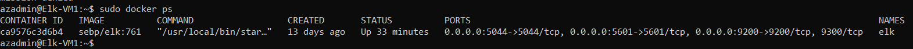

# Utor-cyber

## Automated ELK Stack Deployment

The files in this repository were used to configure the network depicted below.

These files have been tested and used to generate a live ELK deployment on Azure. They can be used to recreate the entire deployment pictured above. Alternatively, select portions of the ansible playbook file may be used to install only certain pieces of it, such as Filebeat.

  - install-elk
  - filebeat-playbook
  - metricbeat-playbook

The configuration details of each machine may be found below.

| Name      | Function             | IP Address | Operating System |
|---------- |-------------------   |------------|------------------|
| Jump Box  | Gateway              | 10.0.0.7   | Linux            |
| Web-1     | Web Server           | 10.0.0.8   | Linux            |
| Web-2     | Web Server           | 10.0.0.9   | Linux            |
| Elk VM1   | ELK/Monitoring Server| 10.1.0.4   | Linux            |

### Access Policies

The machines on the internal network are not exposed to the public Internet. 

Only the Jump Box machine can accept connections from the Internet. Access to this machine is only allowed from the following IP addresses:
- 90.240.174.234

Machines within the network can only be accessed by the Jump Box Provisioner: 10.0.0.7. / 20.121.217.236
 
A summary of the access policies in place can be found in the table below.

| Name     | Publicly Accessible | Allowed IP Addresses |
|----------|---------------------|----------------------|
| Jump Box | Yes                 | 90.240.174.234       |
| Web-1    | No                  | 10.0.0.7             |
| Web-2    | No                  | 10.0.0.7             |
|Elk       | Yes	         | 90.240.174.234       |

### Elk Configuration

Ansible was used to automate configuration of the ELK machine. No configuration was performed manually, which is advantageous because it saves time and resources by allowing the  automation of daily and repetitive tasks.

The playbook implements the following tasks:
- Installs Docker
- Installs python3
- downloads docker image
- Ensures Docker starts automatically on each boot

The following screenshot displays the result of running `docker ps` after successfully configuring the ELK instance.

### Target Machines & Beats
This ELK server is configured to monitor the following machines:
- 10.0.0.8
- 10.0.0.9

We have installed the following Beats on these machines:
- Filebeat
- Metricbeat

These Beats allow us to collect the following information from each machine:
-Filebeat allows for the collection, forwarding and centralisation of logs and files. E.g., "Netflow" allows for traffic analysis on a network which tracks incoming  and outgoing traffic including the source, destination and ports being used.
-Metricbeat collects metrics or statistics from services and systems running on servers such as Apache. 

### Using the Playbook
SSH into the control node and follow the steps below:
- Copy the filebeat-config.yml and metricbeat-config-yml files to the /etc/ansible/roles directory
- Update the above configuration files to include the ip address of the ELK server and the port(s) through which it can be accessed. 
- Run the playbook, and navigate to ELK VM Public IP (http://<elk public IP>:5601/app/kibana) to check that the installation worked as expected.

-copy filebeat-playbook.yml/ metricbeat-playbook.yml to the directory /etc/ansible
- update /etc/ansible/hosts file with the IP of the specific machine on which to runt he playbook.
- Navigate to the public IP of the ELK server to check that the ELK server is up and running : http://168.62.210.117:5601/app/kibana#/home

